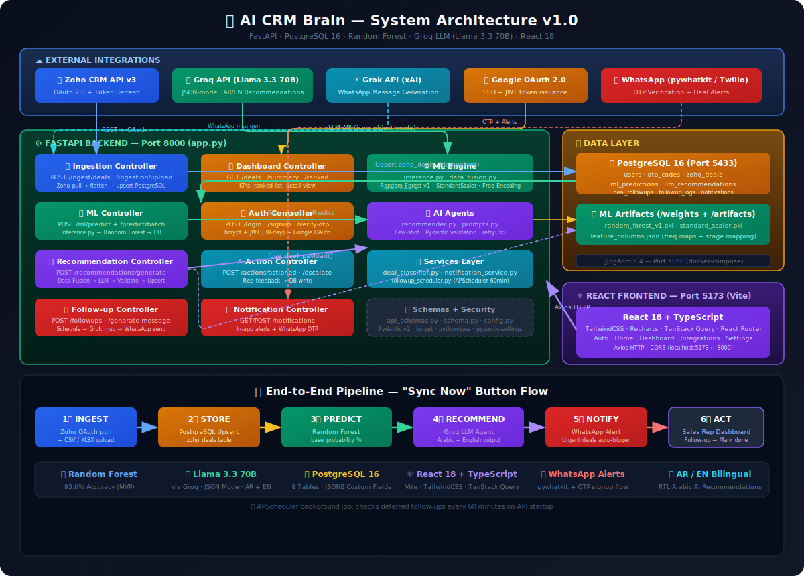
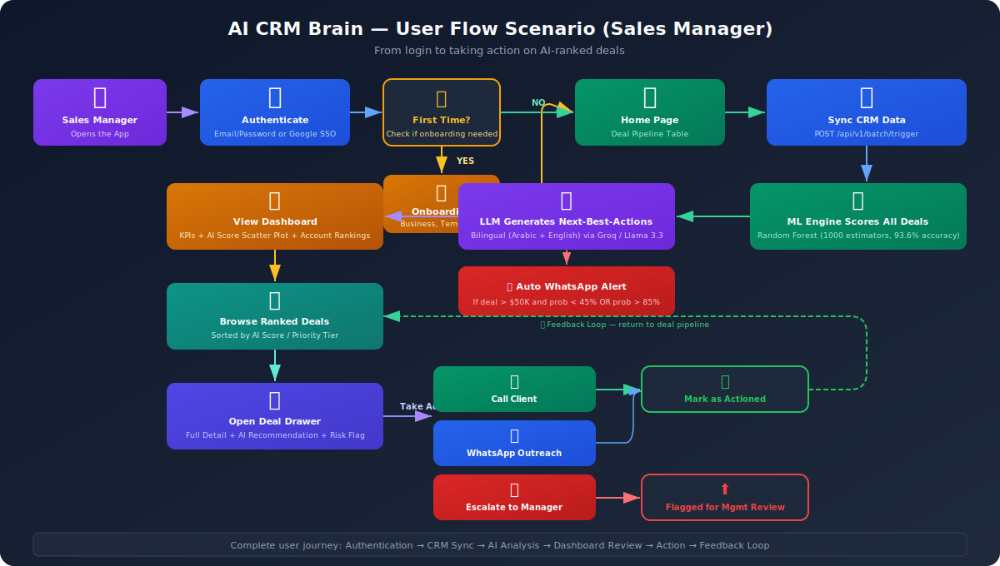
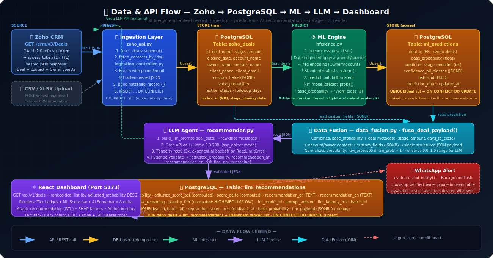

<div align="center">

# 🧠 AI CRM Brain

### *Transform Your CRM from a Data Graveyard into a Revenue-Generating Decision Engine*

[](https://fastapi.tiangolo.com/)
[](https://react.dev/)
[](https://www.postgresql.org/)
[](https://scikit-learn.org/)
[](https://langchain.com/)
[](https://www.docker.com/)
[](https://opensource.org/licenses/MIT)

<br/>

**AI CRM Brain** is an AI-powered decision engine that sits on top of your existing CRM, predicts deal closure probability with **93.6% accuracy** using a Random Forest classifier, and generates **multilingual (Arabic/English) next-best-action recommendations** powered by LLMs — so your sales team knows *exactly* what to do next, on every deal, every day.

[Getting Started](#-setup--installation-guide) · [Architecture](#-visualizing-the-system) · [API Reference](#-api-endpoints) · [Roadmap](#-future-roadmap--expansions)

</div>

---

## 📋 Table of Contents

- [Project Overview and Value Proposition](#-project-overview--value-proposition)
- [Tech Stack and Technologies](#-tech-stack--technologies)
- [Project Structure](#-project-structure)
- [Setup and Installation Guide](#-setup--installation-guide)
- [API Endpoints](#-api-endpoints)
- [Visualizing the System](#-visualizing-the-system)
- [Future Roadmap and Expansions](#-future-roadmap--expansions)
- [Contributing](#-contributing)
- [License](#-license)

---

## 🎯 Project Overview & Value Proposition

### The Problem

Traditional CRMs are **passive data storage boxes**. Sales teams spend hours logging calls, updating deal stages, and filling out forms — yet when it comes time to make a critical decision, they're left staring at static tables and pie charts. There's no intelligence layer telling them:

> *"This $75,000 deal has a 91% chance of closing — call the decision maker at TechFlow within 48 hours to lock it in."*

Without this, sales managers fly blind. High-value deals slip through the cracks. Low-probability deals consume disproportionate effort. Revenue is left on the table.

### The Solution: An AI Decision Engine

**AI CRM Brain** doesn't replace your CRM — it **supercharges it**. The system operates as a three-stage intelligence pipeline:

| Stage | What Happens | Technology |
|:------|:-------------|:-----------|
| 🔄 **Ingest** | Real-time sync of deal data from Zoho CRM via OAuth 2.0 API, with support for manual CSV/XLSX uploads | Zoho REST API v3, Pandas |
| 🤖 **Predict** | A Random Forest classifier (1000 estimators, 93.6% validation accuracy, 0.99 macro AUC) scores every deal with a closure probability | scikit-learn, joblib |
| 🧠 **Recommend** | An LLM agent (Llama 3.3 70B via Groq) receives the ML score + deal context + custom fields, then generates an **adjusted probability** and a **bilingual next-best-action** in Arabic and English | LangChain, OpenAI-compatible API |

### The Added Value

- 📈 **Revenue Acceleration** — AI-ranked deal prioritization ensures reps focus on the highest-ROI opportunities first
- 🌍 **Multilingual Intelligence** — Native Arabic and English recommendations serve MENA-region sales teams natively
- 🚨 **Proactive Alerts** — WhatsApp notifications fire automatically for at-risk deals (>$50K, <45% probability) and hot leads (>85% probability)
- 🔄 **Closed-Loop Feedback** — Sales reps mark actions as taken, creating a feedback loop for continuous model improvement
- 📊 **Executive Dashboards** — Real-time KPIs, AI-score scatter plots, account rankings, and priority-tiered deal tables

---

## 🛠 Tech Stack & Technologies

### 🔧 Backend

| Technology | Purpose |
|:-----------|:--------|
| Python 3.10+ | Core runtime |
| FastAPI 0.109 + Uvicorn | High-performance async REST API |
| SQLAlchemy 2.0 + Alembic | ORM and database schema migrations |
| Pydantic v2 + Pydantic Settings | Request/response validation and env management |

### 🤖 AI / ML

| Technology | Purpose |
|:-----------|:--------|
| scikit-learn 1.4 (Random Forest) | Deal closure prediction (93.6% accuracy) |
| LangChain 0.1 + OpenAI SDK | LLM chain orchestration and prompt engineering |
| Groq API (Llama 3.3 70B) | Ultra-fast LLM inference for recommendations |
| MLflow 2.10 | Experiment tracking and model registry |

### ⚛️ Frontend

| Technology | Purpose |
|:-----------|:--------|
| React 18 + TypeScript | Type-safe UI development |
| Vite 5 | Lightning-fast dev server and build tool |
| TailwindCSS 3 | Utility-first styling with dark mode |
| Recharts | Interactive data visualizations |
| TanStack React Query | Server state management and caching |

### 🗄 Database

| Technology | Purpose |
|:-----------|:--------|
| PostgreSQL 16 | Primary data store with JSONB for custom fields |
| pgAdmin 4 | Database administration GUI |

### 🔐 Security

| Technology | Purpose |
|:-----------|:--------|
| JWT (python-jose) + bcrypt | Stateless auth with password hashing |
| Google OAuth 2.0 | Social SSO login |

### 🐳 DevOps

| Technology | Purpose |
|:-----------|:--------|
| Docker Compose | Containerized PostgreSQL + pgAdmin |
| Tenacity | Retry logic for resilient API calls |

---

## 📁 Project Structure

The project follows a clean **MVC (Model-View-Controller)** architecture with clear separation of concerns:

```
AI-CRM-Brain/
|
|-- app.py                          # FastAPI entry point - registers all routers & CORS
|-- config.py                       # Pydantic Settings - centralized env variable management
|-- requirements.txt                # Python dependencies (pinned versions)
|-- docker-compose.yaml             # PostgreSQL 16 + pgAdmin 4 containers
|-- .env                            # Environment secrets (API keys, DB creds, JWT config)
|
|-- controllers/                    # == CONTROLLERS (API Routes / Business Logic) ==
|   |-- auth_controller.py          #   JWT login, signup with OTP, Google SSO, profile mgmt
|   |-- ingestion_controller.py     #   Zoho CRM sync + CSV/XLSX upload endpoints
|   |-- ml_controller.py            #   ML batch prediction pipeline triggers
|   |-- recommendation_controller.py #  LLM recommendation generation (single + batch)
|   |-- dashboard_controller.py     #   KPIs, ranked deals, deal detail, account analytics
|   +-- action_controller.py        #   Mark-as-actioned, escalation, full pipeline orchestrator
|
|-- models/                         # == MODELS (Data Layer) ==
|   |-- database.py                 #   SQLAlchemy engine, SessionLocal, Base
|   |-- schema.py                   #   ORM: User, OTPCode, ZohoDeal, MLPrediction, LLMRecommendation
|   |-- api_schemas.py              #   Pydantic request/response schemas for all endpoints
|   |
|   |-- ml_engine/                  #   Machine Learning Subsystem
|   |   |-- inference.py            #     Preprocessing pipeline + Random Forest batch inference
|   |   +-- data_fusion.py          #     Merges ML predictions with CRM context for LLM input
|   |
|   |-- ai_agents/                  #   LLM / Generative AI Subsystem
|   |   |-- recommender.py          #     LLMRecommenderService - API calls, retry, validation
|   |   +-- prompts.py              #     System prompt, few-shot examples, prompt builder
|   |
|   +-- data_ingestion/             #   CRM Data Pipeline
|       +-- zoho_api.py             #     OAuth token refresh, deal fetching, JSON flattening
|
|-- views/                          # == VIEWS (Legacy Streamlit Dashboards) ==
|   |-- dashboard.py                #   Streamlit dashboard components
|   |-- components.py               #   Reusable UI widgets
|   +-- screen_*.html               #   Static HTML mockups (design reference)
|
|-- frontend/                       # == FRONTEND (React + TypeScript SPA) ==
|   |-- src/
|   |   |-- App.tsx                 #   Root component with React Router & providers
|   |   |-- pages/                  #   Auth, Onboarding, Home, Dashboard, Integrations, Settings
|   |   |-- components/             #   DealDrawer, ScatterChart, CreateDealModal, OTPModal, etc.
|   |   |-- context/                #   AuthContext (JWT state), ThemeProvider (dark mode)
|   |   |-- services/api.ts         #   Axios HTTP client for FastAPI communication
|   |   +-- types/                  #   TypeScript type definitions
|   |-- package.json                #   React 18, Recharts, TanStack Query, Lucide Icons
|   +-- vite.config.ts              #   Vite dev server config (proxied to :8000)
|
|-- services/                       # == SERVICES (Cross-Cutting Concerns) ==
|   +-- notification_service.py     #   WhatsApp OTP delivery + deal alert notifications
|
|-- utils/                          # == UTILITIES ==
|   +-- security.py                 #   bcrypt hashing, JWT creation/verification
|
|-- weights/                        # == ML MODEL ARTIFACTS ==
|   |-- random_forest_v1.pkl        #   Trained Random Forest model (~16MB, 1000 estimators)
|   +-- model_metadata.json         #   Performance metrics, feature importance, hyperparams
|
|-- artifacts/                      # == PREPROCESSING ARTIFACTS ==
|   |-- standard_scaler.pkl         #   Fitted StandardScaler for feature normalization
|   |-- feature_columns.json        #   Feature column names + frequency encoding maps
|   |-- label_encoder_stage.pkl     #   Stage label encoder (Engaging/Lost/Prospecting/Won)
|   +-- frequency_maps.json         #   Owner & Account frequency encoding dictionaries
|
|-- notebooks/                      # == JUPYTER NOTEBOOKS (ML Development) ==
|   |-- Sprint2_Phase1_EDA_Simple.ipynb        # Exploratory Data Analysis
|   |-- Sprint2_Phase2_Preprocessing.ipynb     # Feature engineering pipeline
|   |-- Sprint2_Phase3_ModelTraining.ipynb      # Model training, evaluation, MLflow logging
|   +-- mlruns/                                # MLflow experiment tracking data
|
+-- data/                           # == RAW & PROCESSED DATASETS ==
    |-- raw data/                   #   Original Zoho CRM exports
    |-- raw data 2/                 #   Secondary data collection
    |-- sales_cleaned/              #   Cleaned datasets after EDA
    +-- Sales_Preprocessed/         #   Feature-engineered datasets ready for training
```

---

## 🚀 Setup & Installation Guide

### Prerequisites

- **Python 3.10+** (Anaconda/Miniconda recommended)
- **Node.js 18+** and **npm**
- **Docker Desktop** (for PostgreSQL)
- **Git**

### Step 1: Clone the Repository

```bash
git clone https://github.com/your-username/AI-CRM-Brain.git
cd AI-CRM-Brain
```

### Step 2: Create & Activate a Conda Environment

```bash
conda create -n ai_crm_brain python=3.10 -y
conda activate ai_crm_brain
```

### Step 3: Install Python Dependencies

```bash
pip install -r requirements.txt
```

### Step 4: Configure Environment Variables

Create a `.env` file in the project root (or copy from the template):

```bash
cp .env.example .env
```

Then fill in the required values:

```env
# -- Zoho CRM API Credentials --
ZOHO_CLIENT_ID="your_zoho_client_id"
ZOHO_CLIENT_SECRET="your_zoho_client_secret"
SCOPE_NAME="your_scope_name"
ZOHO_REFRESH_TOKEN="your_refresh_token"

# -- PostgreSQL Database --
POSTGRES_USER=your_db_user
POSTGRES_PASSWORD="your_db_password"
PGADMIN_EMAIL=your_email@domain.com
PGADMIN_PASSWORD="your_pgadmin_password"
DB_NAME="ai_crm_brain"
DB_PORT="5433"

# -- LLM Configuration (Groq / OpenAI-compatible) --
LLM_API_KEY="your_groq_api_key"
LLM_PROVIDER=groq
LLM_MODEL_ID=llama-3.3-70b-versatile

# -- JWT Authentication --
SECRET_KEY=your_256_bit_secret_key
API_BASE_URL=http://localhost:8000
ALGORITHM="HS256"
ACCESS_TOKEN_EXPIRE_MINUTES=10080
```

### Step 5: Start the Database (Docker)

```bash
docker-compose up -d
```

This starts:
- **PostgreSQL 16** on `localhost:5433`
- **pgAdmin 4** on `localhost:5050`

### Step 6: Run Database Migrations

```bash
# Initialize the database tables
python create_db.py

# Or if using Alembic for migrations:
alembic upgrade head
```

### Step 7: Start the FastAPI Backend

```bash
uvicorn app:app --host 0.0.0.0 --port 8000 --reload
```

The API will be live at:
- **Swagger UI** : `http://localhost:8000/docs`
- **Health Check** : `http://localhost:8000/health`

### Step 8: Start the React Frontend

```bash
cd frontend
npm install
npm run dev
```

The frontend will be live at `http://localhost:5173`

---

## 📡 API Endpoints

All endpoints are prefixed with `/api/v1`.

| Method | Endpoint | Description |
|:-------|:---------|:------------|
| `POST` | `/ingest/deals` | Sync deals from Zoho CRM API to PostgreSQL |
| `POST` | `/ingestion/upload` | Upload CSV/XLSX for custom CRM data |
| `POST` | `/predict/deals` | Run ML predictions on a submitted batch of deals |
| `POST` | `/jobs/run-predictions` | Trigger batch ML predictions from the database |
| `POST` | `/recommendations/generate/{deal_id}` | Generate LLM recommendation for a single deal |
| `POST` | `/recommendations/generate` | Full AI pipeline: ML + LLM for all unprocessed deals |
| `POST` | `/recommendations/batch` | Generate batch LLM recommendations for a specific batch |
| `GET` | `/deals` | Get all deals with pagination, search and sorting |
| `POST` | `/deals` | Create a new deal manually |
| `GET` | `/deals/ranked` | Dashboard summary: KPIs, scatter data, ranked deals |
| `GET` | `/deals/{deal_id}` | Full deal detail with AI recommendation and risk analysis |
| `GET` | `/analytics/accounts/ranked` | Account rankings by average AI win probability |
| `GET` | `/accounts/names` | Distinct account names for dropdowns |
| `PATCH` | `/recommendations/{deal_id}/action` | Mark a recommendation as actioned by sales rep |
| `POST` | `/recommendations/{deal_id}/escalate` | Escalate a deal for management attention |
| `POST` | `/batch/trigger` | Orchestrate full pipeline: Ingest, Predict, Recommend |
| `POST` | `/auth/login` | JWT login with email/password |
| `POST` | `/auth/signup` | 2-step signup with WhatsApp OTP verification |
| `POST` | `/auth/verify-otp` | Verify OTP and issue JWT token |
| `POST` | `/auth/google` | Google OAuth SSO login |
| `GET` | `/auth/users/me` | Get current user profile |
| `PATCH` | `/auth/users/me/templates` | Update user outreach templates |
| `GET` | `/health` | Service health check |

---

## 📊 Visualizing the System

### Diagram 1: System Architecture & Data Flow

This diagram shows the complete system architecture — from external CRM APIs through the AI pipeline to the React frontend, including the WhatsApp notification branch for urgent deals.



---

### Diagram 2: User Flow — Sales Manager Scenario

This diagram traces the full user journey: login, CRM data sync, AI processing, dashboard review, deal inspection, and the action/feedback loop.



---

### Diagram 3: MVC Architecture Interaction

This diagram shows how the three MVC layers interact: React Views make HTTP requests to FastAPI Controllers, which query SQLAlchemy Models and AI subsystems, all backed by PostgreSQL and external APIs.



---

## 🚀 Future Roadmap & Expansions

### Phase 1: Multi-CRM Integration Ecosystem

| Integration | Status | Description |
|:------------|:-------|:------------|
| Zoho CRM | ✅ Live | Full OAuth 2.0 API sync with token auto-refresh |
| Manual Upload (CSV/XLSX) | ✅ Live | File upload endpoint with validation |
| HubSpot CRM | 🔜 Planned | REST API integration with deal and contact sync |
| Salesforce | 🔜 Planned | Bulk API 2.0 integration with SOQL query support |
| Google Sheets | 🔜 Planned | Google Sheets API v4 for lightweight CRM users |

### Phase 2: Domain-Specific Fine-Tuning

Train and deploy **industry-specific ML models** that understand sector-specific deal dynamics:

- 🏠 **Real Estate** — Factors like property type, location tier, financing status, and seasonal demand cycles
- 🚗 **Automotive** — Trade-in value, inventory aging, manufacturer incentives, and credit approval probability
- 💻 **SaaS** — Monthly Recurring Revenue (MRR), churn risk signals, expansion revenue potential, and user engagement metrics
- 🏥 **Healthcare** — Procurement committee cycles, regulatory compliance timelines, and budget allocation periods

Users upload their historical deal data, and the platform trains a custom Random Forest or XGBoost model tailored to their vertical.

### Phase 3: RAG System & Conversational CRM Chatbot

Integrate a **Retrieval-Augmented Generation (RAG)** pipeline that indexes all deal history, communication logs, and recommendation transcripts into a vector database (Pinecone / Weaviate). Sales reps can then:

- 💬 *"Which deals in the automotive sector are most likely to close this quarter?"*
- 💬 *"Show me the AI recommendation history for account TechFlow"*
- 💬 *"What was the average deal cycle length for won deals last quarter?"*

### Phase 4: AI Automation Agent

Move from **recommendations** to **autonomous actions**:

- 📧 **Email Automation** — Auto-draft and send personalized follow-up emails to contacts on high-probability deals, using the rep's custom template
- 📱 **WhatsApp Automation** — Send outreach messages (via Twilio/Meta Business API) to clients with the highest closure probabilities
- 📅 **Calendar Integration** — Auto-schedule follow-up calls based on deal urgency and time zone
- 🔁 **CRM Write-Back** — Update deal stages in Zoho/HubSpot automatically when AI detects stage progression signals

### Phase 5: Advanced Authentication & User Profiles

- **Google SSO** — ✅ Implemented (OAuth 2.0 token verification)
- **WhatsApp OTP** — ✅ Implemented (2-step signup with 6-digit OTP)
- **Role-Based Access Control (RBAC)** — Sales Rep vs. Sales Manager vs. Admin permission tiers
- **Team Management** — Invite team members, assign deal territories, set notification preferences
- **Comprehensive Profile Editing** — Business field, custom outreach templates (WhatsApp + Email), notification settings

### Phase 6: The Ultimate Goal — AI-First CRM

Evolve from an AI layer on *top* of existing CRMs into a **standalone, AI-native CRM platform** where intelligence isn't an add-on — it's the foundation. Every field, every workflow, every notification is powered by AI from Day 1.

---

### 💡 Visionary Features: The Billion-Dollar Expansion

> *The features below represent cutting-edge AI capabilities that would transform AI CRM Brain from a smart analytics tool into an industry-defining platform.*

#### 🔮 1. Predictive Revenue Forecasting with Scenario Simulation

Go beyond deal-level predictions to **company-wide revenue forecasting**. Using Monte Carlo simulations powered by the entire pipeline's probability distributions, sales leaders can:

- See a confidence-banded revenue forecast for the quarter (P10 / P50 / P90)
- Run "what-if" scenarios: *"What happens to our Q3 forecast if we lose the top 3 at-risk deals?"*
- Detect forecast drift in real-time and surface early warnings when projected revenue diverges from target
- Auto-generate board-ready forecast reports with AI-written executive summaries

#### 🧬 2. AI Deal Cloning & Playbook Generation

When a deal closes successfully, the system doesn't just record the win — it **reverse-engineers the winning playbook**:

- Analyzes the sequence of actions, timing, and communication patterns that led to closure
- Creates a reusable "Deal Playbook" that can be applied to similar deals (same industry, deal size, stage)
- New reps can "clone" a successful deal's strategy and receive step-by-step AI-guided coaching
- Over time, builds a **proprietary knowledge base** of winning patterns unique to each organization

#### 🎭 3. AI Sentiment Analysis on Communication Signals

Integrate with email providers and call transcription services (e.g., Gong, Chorus) to analyze the **emotional tone and intent** of client communications:

- Detect enthusiasm, hesitation, objection, or urgency in email threads and call transcripts
- Auto-update deal risk flags based on sentiment shifts (e.g., client tone turned negative after pricing discussion)
- Surface "hidden signals" that humans miss: delayed response times, shorter replies, CC'd stakeholders (buying committee expansion)
- Feed sentiment scores into the ML model as features for even more accurate closure predictions

#### 🌐 4. Competitive Intelligence Radar

Build a real-time competitive intelligence layer that automatically enriches deal context:

- Monitor public signals (press releases, job postings, funding announcements) for accounts in your pipeline
- Auto-detect when a competitor is mentioned in deal notes or custom fields
- Provide AI-generated counter-positioning strategies tailored to each competitor
- Track win/loss ratios against specific competitors over time and surface pattern insights

#### 🔗 5. Cross-Deal Relationship Graph Intelligence

Build a **knowledge graph** that maps relationships between deals, accounts, contacts, and industries:

- Discover hidden connections between accounts through shared contacts and decision-makers
- Identify warm introduction paths through existing customers
- Detect "cluster risks" — when multiple high-value deals depend on the same decision-maker or budget cycle
- Recommend cross-sell and upsell opportunities based on graph proximity and purchase pattern similarity

#### 🏆 6. Gamified Sales Performance & AI Coaching

Transform sales performance management with AI-driven gamification:

- **Real-time leaderboards** ranked by AI-adjusted pipeline value (not just raw revenue)
- **Achievement badges** for following AI recommendations that lead to successful closures
- **AI Sales Coach** — a personalized agent that reviews each rep's deal portfolio weekly and provides tailored improvement suggestions
- **Team challenges** that incentivize CRM data quality and recommendation follow-through

---

## 🤝 Contributing

Contributions are welcome! Please feel free to submit a Pull Request. For major changes, please open an issue first to discuss what you would like to change.

1. Fork the repository
2. Create your feature branch (`git checkout -b feature/AmazingFeature`)
3. Commit your changes (`git commit -m 'Add some AmazingFeature'`)
4. Push to the branch (`git push origin feature/AmazingFeature`)
5. Open a Pull Request

---

## 📜 License

This project is licensed under the MIT License — see the [LICENSE](LICENSE) file for details.

---

<div align="center">

**Built with ❤️ and 🧠 by the AI CRM Brain Team**

*Turning data into decisions. Turning decisions into revenue.*

</div>